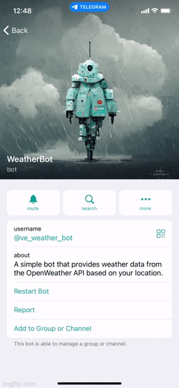

# WeatherBot

Telegram bot that provides weather data from the OpenWeather API based on your current location.

## Demo
https://t.me/ve_weather_bot

## Usage
1. Clone this repository using: `git clone https://github.com/venyxD/weather-bot.git`
2. Create new Telegram bot with [BotFather](https://t.me/BotFather)
3. Copy your bot API token into `config.py`: 
   `BOT_API_TOKEN = 'Paste your bot API token here'`
4. Create an account on [OpenWeatherMap](https://home.openweathermap.org/users/sign_up)
5. Copy your OpenWeather API token into `config.py`: 
   `OPENWEATHER_API_KEY = 'Paste your OpenWeather API token here'`
6. Optional: Go to the project root directory and install the virtualenv library using pip and create a virtual environment. Run the following commands respectively:
   * `pip install virtualenv`
   * `virtualenv venv`
   * `source venv/bin/activate`
7. Download and install all dependencies in the requirements.txt using `pip install -r requirements.txt`
8. Start bot: `$ python bot.py`
9. Open your bot in Telegram and start it with `/start` command

## Tech used
* Python 3
* AIOGram
* OpenWeather API

## Notes
Weather response based on current location only works on iOS and Android mobile devices, not on Telegram desktop app because it does not provide device location.

## TODO
* Add `aiohttp` support to make async http requests
* Add other cities, not only current location
* Add OpenWeather forecast